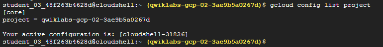
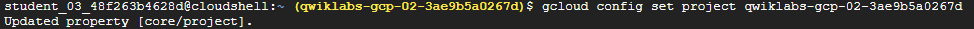
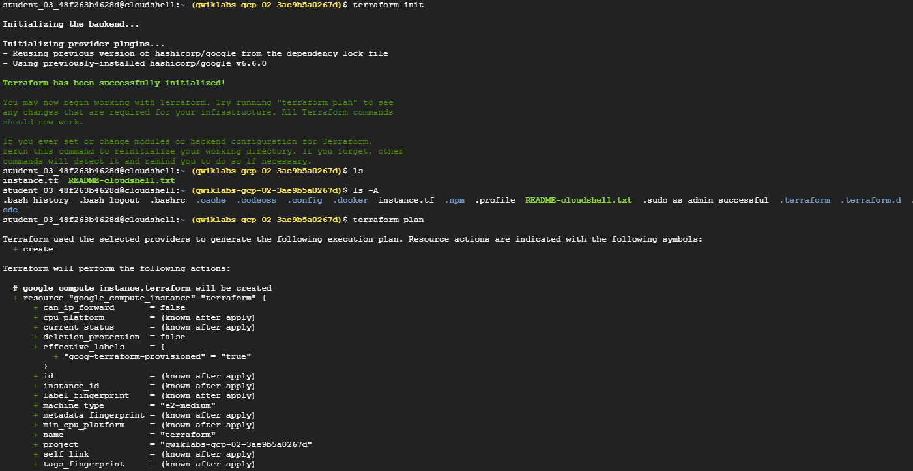
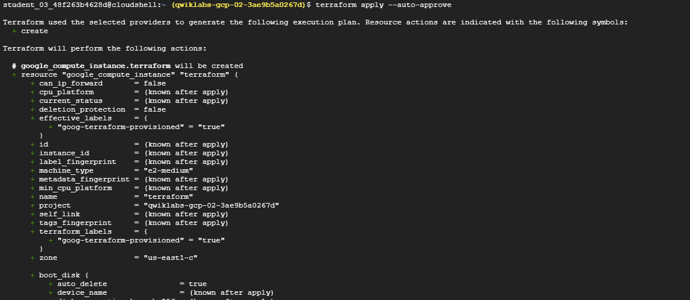
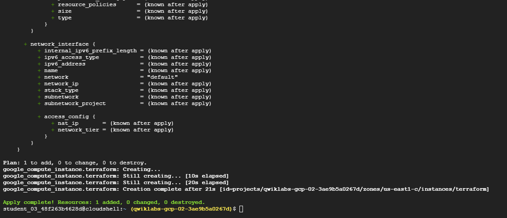
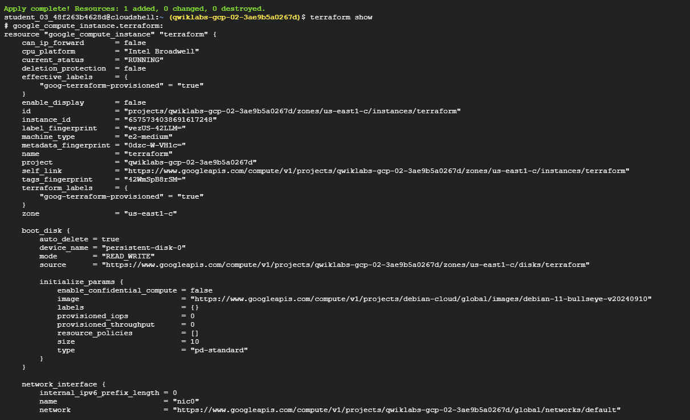
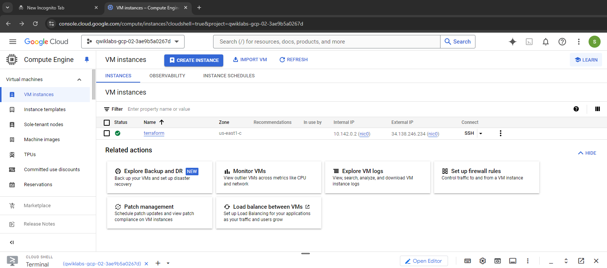

# Terraform Fundamentals

> - Install Terraform from installation binaries
> - Create a VM instance infrastructure using Terraform

Lets confirm the project that's set


if the respective project isn't set we can set by
```shell
gcloud config set project qwiklabs-gcp-02-3ae9b5a0267d
```


### What Terraform ?

It is a tool for 
- building, 
- changing, and 
- versioning infrastructure safely and efficiently. 

Configuration files describe to Terraform the components needed to run a single application or the entire data center. 
> Terraform generates an execution plan describing what it will do to reach the **desired state**, and then executes **it to build the described infrastructure**. As the configuration changes, Terraform <ins>can determine what changed and create incremental execution plans that can be applied</ins>.

The infrastructure Terraform can manage includes both <ins>low-level components such as compute instances, storage, and networking,</ins> and <ins>high-level components such as DNS entries and SaaS features</ins>.

## Key features
Infrastructure as code
Infrastructure is described using a **high-level configuration syntax**. This allows a blueprint of your data center to be versioned and treated as you would any other code. <ins>Additionally, infrastructure can be shared and re-used</ins>.

#### Execution plans
Terraform has a planning step in which it generates an execution plan. <ins>The execution plan shows what Terraform will do when you execute the apply command</ins>. This lets you avoid any surprises when Terraform manipulates infrastructure.

#### Resource graph
<ins>Terraform builds a graph of all your resources and parallelizes the creation and modification of any non-dependent resources.</ins> Because of this, Terraform builds infrastructure as efficiently as possible, and operators get insight into dependencies in their infrastructure.

#### Change automation
<ins>Complex changesets can be applied to your infrastructure with minimal human interaction</ins>. With the previously mentioned execution plan and resource graph, you know exactly what Terraform will change and in what order, which helps you avoid many possible human errors.

Configuration to launch a single VM instance
In Cloud Shell, create an empty configuration file named instance.tf with the following command
```shell
touch instance.tf
```

```json
resource "google_compute_instance" "terraform" {
  project      = "qwiklabs-gcp-02-3ae9b5a0267d"
  name         = "terraform"
  machine_type = "e2-medium"
  zone         = "us-east1-c"

  boot_disk {
    initialize_params {
      image = "debian-cloud/debian-11"
    }
  }

  network_interface {
    network = "default"
    access_config {
    }
  }
}
```
This is a complete configuration that Terraform is ready to apply. The general structure should be intuitive and straightforward.

The "resource" block in the instance.tf file defines a resource that exists within the infrastructure. A resource might be a physical component such as an VM instance.

The resource block has two strings before opening the block: the **resource type** and the **resource name**. Here, the resource type is `google_compute_instance` and the name is `terraform`. The prefix of the type maps to the provider: `google_compute_instance` automatically tells Terraform that it is managed by the `Google` provider.

### Initialization

The first command to run for a new configuration—or after checking out an existing configuration from version control—is `terraform init`. This initializes local settings and data for subsequent commands.

Terraform uses a plugin-based architecture to support various infrastructure and service providers. Each provider is an encapsulated binary distributed separately from Terraform. The `terraform init` command automatically downloads and installs the provider binaries needed for the configuration.

#### Command to Initialize

```sh
terraform init
```

#### What Happens During Initialization

- **Provider Plugin Download:** The Google provider plugin is downloaded and installed in a subdirectory of the current working directory.
- **Initialization Message:** You will see an "Initializing provider plugins" message.
- **Version Information:** The output specifies the version of the plugin being installed.

#### Example Output

```sh
Installing hashicorp/google v4.77.0...
Note: Your version number may be higher.
```

Specifying the version in future configuration files ensures compatibility.

### Summary

- **Command:** `terraform init`
- **Purpose:** Initializes local settings and downloads provider binaries.
- **Provider:** Google provider plugin is downloaded and installed.
- **Versioning:** Specify the version to ensure compatibility.


Create an execution plan:
```sh
terraform plan
```

Terraform performs a refresh, unless explicitly disabled, and then determines what actions are necessary to achieve the desired state specified in the configuration files. This command is a convenient way to check whether the execution plan for a set of changes matches your expectations without making any changes to real resources or to the state. For example, you might run this command before committing a change to version control, to create confidence that it will behave as expected.

**Note:** The optional `-out` argument can be used to save the generated plan to a file for later execution with `terraform apply`.


### Apply Changes

In the same directory as `instance.tf`, run:
```sh
terraform apply
```

This shows the Execution Plan, detailing actions Terraform will take to match the configuration. A `+` next to `google_compute_instance.terraform` indicates creation. Attributes marked as `<computed>` will be known after resource creation.




Terraform state file



We've built our first infrastructure with Terraform


